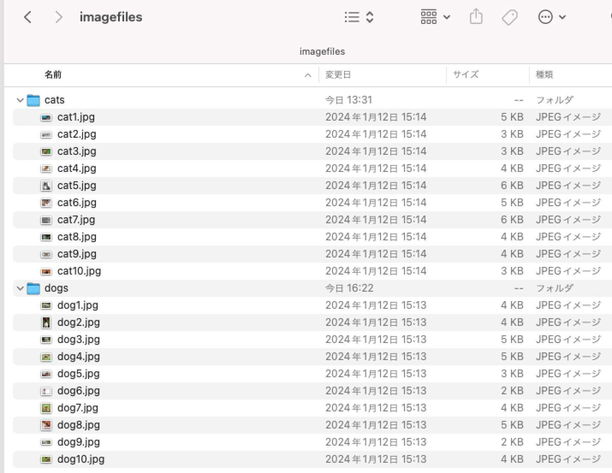

# 自分のデータで分析するには

本書に沿って実習できるよう，サンプルデータファイルを提供しています．さらに応用として，自分で分析したい画像や音声，テキストのデータファイルを用意すれば，それらを使って分析をすることもできます．

ここでは，データファイルの準備と設定の方法について説明します．
基本編は，各教材で使用しているサンプルデータファイルをダウンロードするためのリンクとファイルの中身の説明です．実習の手順は，各教材に記載されていますので，教材に沿って実習をしてください．
応用編は，自分で分析したいデータファイルを準備する方法です．注意点に気をつけてデータファイルを準備してください．
分析プログラムにデータを読み込む具体的な方法は，2,3 を参照してください．

2. データを読み込む方法１：ドラッグ&ドロップ（コピー＆ペースト）
3. データを読み込む方法２：Import関数でファイルを読み込む
  [5-4 1枚の画像から複数の画像データに分割する方法 »](https://wolfr.am/DS_5-4)

### 1 データファイルの準備と設定

#### 1. 基本編：本書および実践編で使用しているサンプルデータファイルについて

この本書および実践編で実習に使用しているファイルは以下のリンクからダウンロードできます．

リンクをクリックするとSampleDataFiles.zipのダウンロード画面が開きます．自分のPCにダウンロードし，解凍して下さい．

SampleDataFilesフォルダの中には以下の３つのフォルダがあります：

■画像ファイル　 ImageDataFilesフォルダ：

    「3章 画像データからみえる世界」の実習で使われるファイルが格納されています．
「ImageDataFiles」フォルダの中には，「animals」, 「snacks」 の2つのフォルダがあります．
「animals 」フォルダには，「cats」, 「dogs」, 「tigers 」のフォルダにそれぞれ動物の画像ファイルが10個ずつ，「snacks」フォルダには，2種類のお菓子を箱から出して並べた画像が2個と，個々の画像ファイルが10個ずつ入っています．

■ 音声ファイル　AudioDataFilesフォルダ：

    「3章 音・音声データからみえる世界」の実習で使われるファイルが格納されています．
「AudioDataFiles」フォルダの中には，「cats」, 「birds」, 「cows 」のフォルダがあり，それぞれの動物の鳴き声データが10個ずつ入っています．

■ テキストファイル　TextDataFilesフォルダ：

    「4章 テキストデータからみえる世界」の実習で使われるファイルが格納されています．
「TextDataFiles」フォルダの中には，青空文庫から著作権フリーの11個の作品を形態素解析したテキストファイルが入っています．そのほかに，授業アンケート結果を形態素解析したテキストファイルが1個あります．

実習時の手順については，各本書および実践編の指示に従ってください．

#### 2. 応用編：分析したいデータを自分で準備する場合

オープンデータや自分で撮影した画像データ，録音した音データなどをコンピュータからアクセスできるようにしておくと，そのデータで実験することができます．
基本的には，コンピュータの中に，わかりやすい名前をつけたフォルダ（ディレクトリ）を作成し，その中にデータファイルを移動もしくはコピーしておきます．

##### 重要！　ーなぜグループ別にフォルダを作る必要があるのでしょうか？ー

教師あり機械学習(*1)を行う場合，グループごとに，データに名前（ラベル）をつける必要があります．同じグループのデータを１つのフォルダに入れておくと，プログラムで，フォルダ名と同じ名前をデータに付与することができます．フォルダ名，データファイル名は日本語ではなく，半角英数の英単語にしましょう．プログラムでファイルやフォルダ名を指定するときに安全です．

例えば，「犬」と「猫」の画像データがある場合は，下の図1 のように，犬のデータを入れたフォルダ名を「dogs」，猫のデータを入れたフォルダ名を「cats」として，それぞれのデータをフォルダに入れておきます．

図1. 分析に使いたいデータファイルの構成例

これでデータの準備は終了です．
次に，プログラムにデータを読み込みます．データを読み込む方法は，「ドラッグ&ドロップで読み込む方法」と「Import関数で読み込む方法」の2通りあります．詳細は以下の章を参照してください．
2. データを読み込む方法１：ドラッグ&ドロップ（コピー＆ペースト） 
3.データを読み込む方法２：Import関数でファイルを読み込む 

(*1) 機械学習について詳しくは「2章 画像データから見える世界」を参照してください．

##### さらに応用：1枚の画像データから複数の画像データに分割する方法

画像データを自分で準備する際，対象物として自分で撮影したものを使いたい，ということがあるかもしれません．その際，対象物の写真を1枚ずつ撮影するのではなく，複数の対象物をまとめて撮影した写真（画像データ）を用いる方が効率が良いでしょう．1枚の画像データから，対象物を個々に分割して別々の画像データにする方法については，4.を参照してください．